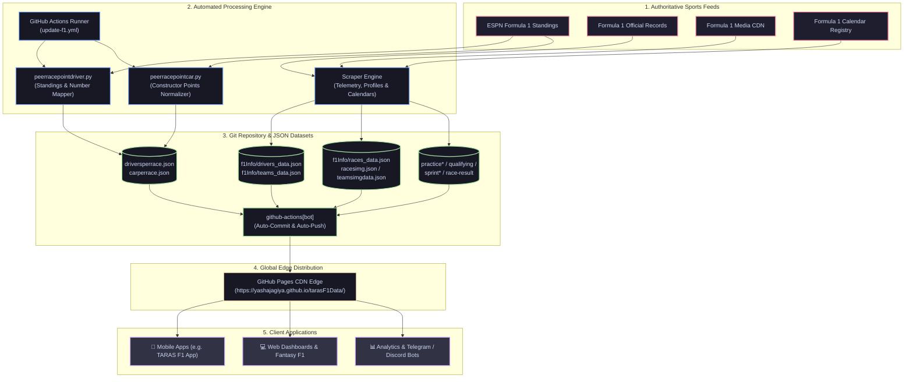
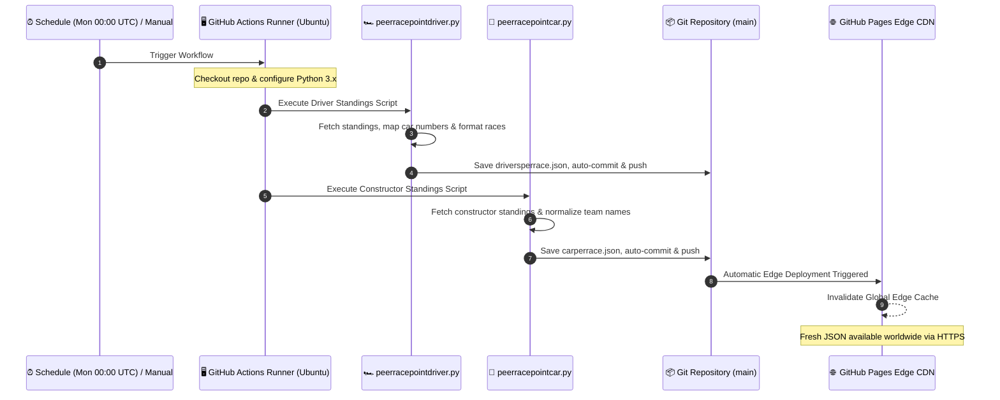
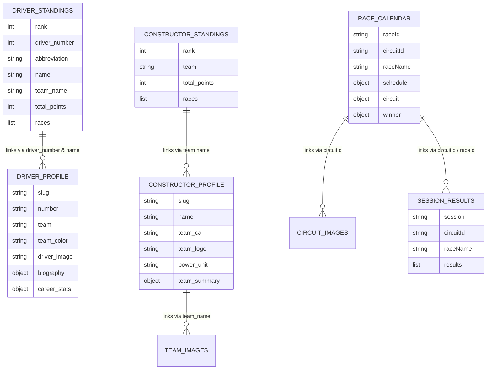

<div align="center">

# 🏎️ tarasF1Data
### Zero-Latency, Edge-Cached Formula 1 Headless REST API & Dataset

[](https://github.com/yashajagiya/tarasF1Data/actions/workflows/update-f1.yml)
[](https://yashajagiya.github.io/tarasF1Data/)
[](https://www.formula1.com)
[](https://yashajagiya.github.io/tarasF1Data/)
[](https://yashajagiya.github.io/tarasF1Data/)
[](LICENSE)

<p align="center">
  <b>A static REST API delivering Formula 1 championship standings, driver dossiers, team specifications, weekend session telemetry, and high-resolution media assets.</b>
</p>

[🌐 API Endpoints Directory](#-api-endpoints-directory) • [🏗️ How It Works](#-how-it-works-honest-technical-architecture) • [⚡ GitHub Action Pipeline](#-automated-github-action-pipeline) • [📖 Detailed Data Points & Expandable Schemas](#-detailed-data-points--expandable-schemas)

---

</div>

## 📌 Core Features & Overview

<table>
  <tr>
    <td width="50%">
      <h3>⚡ Edge-Delivered & Serverless</h3>
      <ul>
        <li><b>Zero Latency:</b> Globally replicated across GitHub's worldwide CDN edge servers.</li>
        <li><b>100% Free & Open:</b> No API keys required, no rate limits, and no monthly quotas.</li>
        <li><b>High Availability:</b> Pure static JSON files with zero database downtimes or cold starts.</li>
      </ul>
    </td>
    <td width="50%">
      <h3>🔄 Autonomous Weekly Updates</h3>
      <ul>
        <li><b>Monday Automation:</b> Standings recalculate automatically every Monday at 00:00 UTC post-race.</li>
        <li><b>Full Weekend Telemetry:</b> Dedicated classifications for FP1, FP2, FP3, Qualy, Sprint, and Race.</li>
        <li><b>High-Res Assets:</b> Official transparent track outlines, 2026 car renders, and vector logos.</li>
      </ul>
    </td>
  </tr>
</table>

---

## 🏗️ How It Works: Honest Technical Architecture

This project does **not** rely on costly database servers (like PostgreSQL or MongoDB) or complex backend microservices. Instead, it operates on a **GitOps headless API pattern**:



### Honest Details on How the Pipeline Operates:
1. **Raw Sports Data Collection**:
   - Championship standings and points breakdowns are sourced from ESPN Formula 1 Standings.
   - Driver biographies, career achievements, and session telemetry are parsed from official Formula 1 records.
   - Transparent vector graphics and car renders are cataloged from Formula 1 media assets.
2. **Deterministic Data Normalization**:
   - Raw ESPN standings lack official permanent car numbers; `peerracepointdriver.py` cross-references driver names with `f1Info/drivers_data.json` to inject accurate permanent car racing numbers (e.g. `12` for Antonelli, `63` for Russell).
   - Constructor names are cleaned and standardized (e.g., converting `"Red Bull"` to `"Red Bull Racing"` and `"Haas"` to `"Haas F1 Team"`).
   - All session dates and times are unified into ISO 8601 UTC formats (`YYYY-MM-DD` and `HH:MM:SSZ`).
3. **Automated Commit & CDN Delivery**:
   - Updated files are saved as indented JSON and committed to the `main` branch by `github-actions[bot]`.
   - GitHub Pages rebuilds instantly, deploying the JSON files to edge servers worldwide in under 30 seconds.

---

## ⚡ Automated GitHub Action Pipeline

The repository stays synchronized without human maintenance through [`.github/workflows/update-f1.yml`](.github/workflows/update-f1.yml).



### What the Action Does:
- **Scheduled Trigger**: Runs on a cron schedule (`0 0 * * 1`) every Monday at `00:00 UTC` (Sunday night in Europe/Americas), right after race weekends finish.
- **Manual Trigger**: Supports `workflow_dispatch` so developers can trigger a sync anytime from GitHub's Actions tab.
- **Rebase & Auto-stash**: Handles concurrent commits gracefully using `git pull --rebase --autostash` before pushing to avoid conflicts.

---

## 🗂️ Data Entity Relationship Model

This diagram illustrates how keys connect across all JSON datasets:



---

## 📂 Repository File Structure

```text
📦 tarasF1Data/
├── 📂 .github/workflows/
│   └── ⚡ update-f1.yml                   # Automated Monday standings update action
├── 📂 f1Info/                             # Core Formula 1 encyclopedic datasets
│   ├── 📄 drivers_data.json               # Comprehensive 2026 driver profiles & career stats
│   ├── 📄 teams_data.json                 # Comprehensive constructor specs & team histories
│   ├── 📄 races_data.json                 # 2026 calendar, session schedules & circuit records
│   └── 📂 code/                           # Core web scrapers for encyclopedia generation
├── 📂 practice1/                          # Free Practice 1 timing & results
│   └── 📄 fp1_extracted.json
├── 📂 practice2/                          # Free Practice 2 timing & results
│   └── 📄 fp2_extracted.json
├── 📂 practice3/                          # Free Practice 3 timing & results
│   └── 📄 fp3_extracted.json
├── 📂 qualifying/                         # Grand Prix Knockout Qualifying (Q1, Q2, Q3)
│   └── 📄 qualifying_results.json
├── 📂 sprint-quly/                        # Sprint Qualifying Shootout (SQ1, SQ2, SQ3)
│   └── 📄 sprint_quly_result.json
├── 📂 sprint-race/                        # Saturday 100km Sprint Race Classification
│   └── 📄 sprint_race_result.json
├── 📂 race-result/                        # Sunday Grand Prix Official Classification
│   └── 📄 race_results.json
├── 📄 driversperrace.json                 # Real-time Driver Championship & per-race points
├── 📄 carperrace.json                     # Real-time Constructor Championship & per-race points
├── 📄 racesimg.json                       # Circuit track layout transparent maps
├── 📄 teamsimgdata.json                   # Team logos, ARGB colors & 2026 car liveries
├── 🐍 peerracepointdriver.py              # Driver standings processing engine
└── 🐍 peerracepointcar.py                 # Constructor standings processing engine
```

---

## 🌐 API Endpoints Directory

All datasets are accessible through the base URL:
```text
https://yashajagiya.github.io/tarasF1Data/
```

### 🏆 1. Championship & Standings

| Method | Dataset | Endpoint Path | Direct URL Link |
|:---:|:---|:---|:---:|
| `GET` | **Driver Standings & Per-Race Points** | `driversperrace.json` | [🔗 Open JSON](https://yashajagiya.github.io/tarasF1Data/driversperrace.json) |
| `GET` | **Constructor Standings & Per-Race Points** | `carperrace.json` | [🔗 Open JSON](https://yashajagiya.github.io/tarasF1Data/carperrace.json) |

### 🏎️ 2. Drivers, Teams & Media Assets

| Method | Dataset | Endpoint Path | Direct URL Link |
|:---:|:---|:---|:---:|
| `GET` | **Full Driver Profiles & Career Dossiers** | `f1Info/drivers_data.json` | [🔗 Open JSON](https://yashajagiya.github.io/tarasF1Data/f1Info/drivers_data.json) |
| `GET` | **Constructor Profiles & Technical Specs** | `f1Info/teams_data.json` | [🔗 Open JSON](https://yashajagiya.github.io/tarasF1Data/f1Info/teams_data.json) |
| `GET` | **Team Branding, Colors & 2026 Cars** | `teamsimgdata.json` | [🔗 Open JSON](https://yashajagiya.github.io/tarasF1Data/teamsimgdata.json) |
| `GET` | **Track Map Layout Outlines** | `racesimg.json` | [🔗 Open JSON](https://yashajagiya.github.io/tarasF1Data/racesimg.json) |

### 📅 3. Calendar & Circuits

| Method | Dataset | Endpoint Path | Direct URL Link |
|:---:|:---|:---|:---:|
| `GET` | **2026 Calendar, Sessions & Circuit Records** | `f1Info/races_data.json` | [🔗 Open JSON](https://yashajagiya.github.io/tarasF1Data/f1Info/races_data.json) |

### ⏱️ 4. Live Race Weekend Telemetry & Results

| Method | Session | Endpoint Path | Direct URL Link |
|:---:|:---|:---|:---:|
| `GET` | **Practice 1 (FP1)** | `practice1/fp1_extracted.json` | [🔗 Open JSON](https://yashajagiya.github.io/tarasF1Data/practice1/fp1_extracted.json) |
| `GET` | **Practice 2 (FP2)** | `practice2/fp2_extracted.json` | [🔗 Open JSON](https://yashajagiya.github.io/tarasF1Data/practice2/fp2_extracted.json) |
| `GET` | **Practice 3 (FP3)** | `practice3/fp3_extracted.json` | [🔗 Open JSON](https://yashajagiya.github.io/tarasF1Data/practice3/fp3_extracted.json) |
| `GET` | **Grand Prix Qualifying (Q1-Q3)** | `qualifying/qualifying_results.json` | [🔗 Open JSON](https://yashajagiya.github.io/tarasF1Data/qualifying/qualifying_results.json) |
| `GET` | **Sprint Qualifying (SQ1-SQ3)** | `sprint-quly/sprint_quly_result.json` | [🔗 Open JSON](https://yashajagiya.github.io/tarasF1Data/sprint-quly/sprint_quly_result.json) |
| `GET` | **Sprint Race Results & Points** | `sprint-race/sprint_race_result.json` | [🔗 Open JSON](https://yashajagiya.github.io/tarasF1Data/sprint-race/sprint_race_result.json) |
| `GET` | **Grand Prix Main Race Results** | `race-result/race_results.json` | [🔗 Open JSON](https://yashajagiya.github.io/tarasF1Data/race-result/race_results.json) |

---

## 📖 Detailed Data Points & Expandable Schemas

---

### 1. Driver Standings & Per-Race Breakdown

- **Endpoint URL:** `https://yashajagiya.github.io/tarasF1Data/driversperrace.json`
- **Data Origin:** ESPN Formula 1 Standings (merged with driver car number mappings)
- **Generator Script:** `peerracepointdriver.py`
- **Update Frequency:** Automated weekly post-race

#### What This Data Gives:
Live standings for the World Drivers' Championship. For every driver, it supplies their standing rank, permanent car number, name, timing abbreviation, team, nationality, season total points, and a round-by-round points breakdown for every Grand Prix.

#### Quick JSON Preview:
```json
{
  "displayName": "Driver Standings",
  "season": "2026",
  "entries": [
    {
      "rank": 1,
      "driver_number": 12,
      "name": "Kimi Antonelli",
      "abbreviation": "ANT",
      "team_name": "Mercedes",
      "championshipPts": { "value": 242, "displayValue": "242" }
    }
  ]
}
```

<details>
<summary><b>📂 Click to expand full sample JSON payload for Driver Standings</b></summary>

```json
{
  "displayName": "Driver Standings",
  "season": "2026",
  "entries": [
    {
      "rank": 1,
      "driver_number": 12,
      "name": "Kimi Antonelli",
      "shortName": "K. Antonelli",
      "abbreviation": "ANT",
      "team_name": "Mercedes",
      "nationality": "Italy",
      "championshipPts": {
        "value": 242,
        "displayValue": "242"
      },
      "races": [
        {
          "name": "AUS",
          "displayName": "Qatar Airways Australian Grand Prix",
          "played": true,
          "value": 18,
          "displayValue": "18"
        },
        {
          "name": "CHN",
          "displayName": "Heineken Chinese Grand Prix",
          "played": true,
          "value": 29,
          "displayValue": "29"
        }
      ]
    }
  ]
}
```
</details>

#### Field-by-Field Detailed Breakdown:
| Field Name | Data Type | Detailed Explanation |
|---|---|---|
| `displayName` | `String` | Official category title (`"Driver Standings"`). |
| `season` | `String` | Championship calendar season (`"2026"`). |
| `entries[]` | `Array` | Ordered list of drivers, ranked 1st to last. |
| `entries[].rank` | `Integer` | Position in championship standings (1 to 22). |
| `entries[].driver_number` | `Integer` | FIA permanent car racing number (e.g. `12`, `63`, `1`). |
| `entries[].name` | `String` | Full official driver name (e.g. `"Kimi Antonelli"`). |
| `entries[].shortName` | `String` | Initial + surname format (e.g. `"K. Antonelli"`). |
| `entries[].abbreviation` | `String` | Official 3-letter broadcast timing acronym (e.g. `"ANT"`). |
| `entries[].team_name` | `String` | Team / constructor name (e.g. `"Mercedes"`). |
| `entries[].nationality` | `String` | Driver nationality (e.g. `"Italy"`). |
| `entries[].championshipPts.value` | `Integer` | Total season points as integer (e.g. `242`). |
| `entries[].championshipPts.displayValue` | `String` | Total season points as string (`"242"`). |
| `entries[].races[]` | `Array` | All 22+ rounds on the calendar. |
| `entries[].races[].name` | `String` | 3-letter race acronym (e.g. `"AUS"`). |
| `entries[].races[].displayName` | `String` | Full Grand Prix name. |
| `entries[].races[].played` | `Boolean` | `true` if race has completed; `false` if upcoming. |
| `entries[].races[].value` | `Integer` | Points scored in that round (combines Sprint + GP). |
| `entries[].races[].displayValue` | `String` | Formatted points string (empty `""` if upcoming). |

---

### 2. Constructor Standings & Per-Race Breakdown

- **Endpoint URL:** `https://yashajagiya.github.io/tarasF1Data/carperrace.json`
- **Data Origin:** ESPN Formula 1 Constructor Standings (with official team name normalization)
- **Generator Script:** `peerracepointcar.py`
- **Update Frequency:** Automated weekly post-race

#### What This Data Gives:
Live standings for the World Constructors' Championship. Ranks all 11 teams and gives round-by-round points accumulated by both cars for every Grand Prix.

#### Quick JSON Preview:
```json
{
  "displayName": "Constructor Standings",
  "season": "2026",
  "entries": [
    {
      "rank": 1,
      "team": "Mercedes",
      "points": { "value": 425, "displayValue": "425" }
    }
  ]
}
```

<details>
<summary><b>📂 Click to expand full sample JSON payload for Constructor Standings</b></summary>

```json
{
  "displayName": "Constructor Standings",
  "season": "2026",
  "entries": [
    {
      "rank": 1,
      "team": "Mercedes",
      "points": {
        "value": 425,
        "displayValue": "425"
      },
      "races": [
        {
          "name": "AUS",
          "displayName": "Qatar Airways Australian Grand Prix",
          "played": true,
          "value": 43,
          "displayValue": "43"
        }
      ]
    }
  ]
}
```
</details>

#### Field-by-Field Detailed Breakdown:
| Field Name | Data Type | Detailed Explanation |
|---|---|---|
| `displayName` | `String` | Championship title (`"Constructor Standings"`). |
| `season` | `String` | Championship year (`"2026"`). |
| `entries[]` | `Array` | Ordered list of 11 constructors, ranked 1st to last. |
| `entries[].rank` | `Integer` | Team's ranking on the leaderboard (1 to 11). |
| `entries[].team` | `String` | Normalized team name (e.g. `"Mercedes"`, `"Ferrari"`, `"Red Bull Racing"`). |
| `entries[].points.value` | `Integer` | Total constructor championship points as integer. |
| `entries[].points.displayValue` | `String` | Total constructor points as string (`"425"`). |
| `entries[].races[]` | `Array` | All rounds on the 2026 calendar. |
| `entries[].races[].name` | `String` | 3-letter race code (e.g. `"AUS"`). |
| `entries[].races[].displayName` | `String` | Official Grand Prix title. |
| `entries[].races[].played` | `Boolean` | `true` if completed; `false` if scheduled. |
| `entries[].races[].value` | `Integer` | Combined points scored by both team drivers in that round. |
| `entries[].races[].displayValue` | `String` | Formatted points string (`"43"` for a 1-2 finish). |

---

### 3. Complete Driver Profiles & Career Dossiers

- **Endpoint URL:** `https://yashajagiya.github.io/tarasF1Data/f1Info/drivers_data.json`
- **Data Origin:** Formula 1 Driver Profiles & Biographies
- **Generator Script:** `f1Info/code/scrape_drivers.py`

#### What This Data Gives:
Encyclopedic profiles for all 22 drivers. Includes transparent cutouts, transparent racing number graphics, 32-bit ARGB hex colors, date/place of birth, career narratives, quotes, 2026 season counters, and all-time career statistics.

#### Quick JSON Preview:
```json
[
  {
    "slug": "george-russell",
    "hero": {
      "first_name": "George",
      "last_name": "Russell",
      "team": "Mercedes",
      "number": "63",
      "team_color": "0xFF27F4D2"
    },
    "season_2026": { "Season Points": "183", "Grand Prix Wins": "2" }
  }
]
```

<details>
<summary><b>📂 Click to expand full sample JSON payload for Driver Profiles</b></summary>

```json
[
  {
    "slug": "george-russell",
    "url": "https://www.formula1.com/en/drivers/george-russell",
    "hero": {
      "first_name": "George",
      "last_name": "Russell",
      "country": "Great Britain",
      "team": "Mercedes",
      "number": "63",
      "team_color": "0xFF27F4D2",
      "accessible_color": "#067e6a",
      "driver_image": "https://media.formula1.com/image/upload/c_fill,w_720,h_720/q_auto/v1740000001/common/f1/2026/mercedes/2026mercedesgeorus01right.webp",
      "driver_number_logo": "https://media.formula1.com/image/upload/c_fit,h_100/q_auto/v1740000001/common/f1/2026/mercedes/2026mercedesgeorus01numberwhite.webp"
    },
    "biography": {
      "Date of Birth": "15/02/1998",
      "Place of Birth": "King's Lynn, England",
      "text": ["He’s the driver with the motto: “If in doubt, go flat out”..."],
      "quote": {
        "text": "ON GEORGE, YOU CAN RELY ON HIM...",
        "author": "Toto Wolff"
      }
    },
    "season_2026": {
      "Season Position": "2nd",
      "Season Points": "183",
      "Grand Prix Races": "12",
      "Grand Prix Points": "173",
      "Grand Prix Wins": "2",
      "Grand Prix Podiums": "6",
      "Grand Prix Poles": "4",
      "Grand Prix Top 10s": "11",
      "DHL Fastest Laps": "3",
      "DNFs": "2",
      "Sprint Races": "3",
      "Sprint Points": "10",
      "Sprint Wins": "0",
      "Sprint Podiums": "1",
      "Sprint Poles": "1",
      "Sprint Top 10s": "3"
    },
    "career_stats": {
      "Grands Prix Entered": "164",
      "Career Points": "1216",
      "Highest Race Finish": "1 (x7)",
      "Podiums": "30",
      "Highest Grid Position": "1 (x12)",
      "Pole Positions": "12",
      "World Championships": "0"
    }
  }
]
```
</details>

#### Field-by-Field Detailed Breakdown:
| Section | Key Name | Data Type | Detailed Explanation |
|---|---|---|---|
| **Identity** | `slug` | `String` | URL slug identifying the driver (e.g. `"george-russell"`). |
| | `url` | `String` | Official F1 website driver page URL. |
| **Hero** | `first_name`, `last_name`| `String` | Split components of driver's name. |
| | `country` | `String` | Nation represented by the driver. |
| | `team` | `String` | Current team / constructor affiliation. |
| | `number` | `String` | Racing number string (`"63"`). |
| | `team_color` | `String` | 32-bit ARGB hex color (`"0xFF27F4D2"`). |
| | `accessible_color` | `String` | WCAG high-contrast accessible color (`"#067e6a"`). |
| | `driver_image` | `String` | CDN URL to transparent cutout photo of driver. |
| | `driver_number_logo`| `String`| CDN URL to transparent white vector racing number graphic. |
| **Biography** | `Date of Birth` | `String` | Birthdate formatted as `DD/MM/YYYY`. |
| | `Place of Birth` | `String` | City and country of birth. |
| | `text[]` | `Array<String>`| Multi-paragraph career background narrative. |
| | `quote.text`, `author`| `String` | Notable quote and author (e.g. `"Toto Wolff"`). |
| **Season 2026** | `Season Position` | `String` | Championship rank with suffix (`"2nd"`). |
| | `Season Points` | `String` | Total points earned this season. |
| | `Grand Prix Wins`, `Podiums`| `String`| Main race victories and top-3 finishes. |
| | `Grand Prix Poles`, `Top 10s`| `String`| Main race pole positions and top-10 finishes. |
| | `DHL Fastest Laps`, `DNFs`| `String`| Fastest lap awards and retirements count. |
| | `Sprint Wins`, `Podiums`, `Points`| `String`| Sprint weekend performance metrics. |
| **Career Stats**| `Grands Prix Entered`| `String`| All-time career Grand Prix entries. |
| | `Career Points` | `String` | Cumulative all-time career points scored. |
| | `Highest Race Finish`| `String`| Best career finish and count (e.g. `"1 (x7)"`). |
| | `Podiums`, `Pole Positions`| `String`| Career podiums and pole position counts. |
| | `World Championships`| `String`| World Drivers' Championship titles won. |

---

### 4. Constructor Profiles & Technical Specs

- **Endpoint URL:** `https://yashajagiya.github.io/tarasF1Data/f1Info/teams_data.json`
- **Data Origin:** Formula 1 Team Profiles & Technical Specifications
- **Generator Script:** `f1Info/code/scrape_teams.py`

#### What This Data Gives:
Technical specifications and heritage dossiers for all 11 teams. Includes transparent 2026 car liveries, vector logos, Team Principal, Technical Director, chassis code, engine supplier, and historical statistics.

#### Quick JSON Preview:
```json
[
  {
    "slug": "mercedes",
    "hero": {
      "name": "Mercedes",
      "team_color": "0xFF27F4D2",
      "team_car": "https://media.formula1.com/.../2026mercedescarright.webp"
    },
    "team_profile": { "Chassis": "W17", "Power Unit": "Mercedes" }
  }
]
```

<details>
<summary><b>📂 Click to expand full sample JSON payload for Constructor Profiles</b></summary>

```json
[
  {
    "slug": "mercedes",
    "hero": {
      "name": "Mercedes",
      "team_color": "0xFF27F4D2",
      "team_car": "https://media.formula1.com/image/upload/c_lfill,h_224/q_auto/v1740000001/common/f1/2026/mercedes/2026mercedescarright.webp",
      "team_logo": "https://media.formula1.com/image/upload/c_lfill,w_64/q_auto/v1740000001/common/f1/2026/mercedes/2025mercedeslogowhite.webp"
    },
    "team_profile": {
      "Full Team Name": "Mercedes-AMG PETRONAS Formula One Team",
      "Base": "Brackley, United Kingdom",
      "Team Chief": "Toto Wolff",
      "Technical Chief": "James Allison",
      "Chassis": "W17",
      "Power Unit": "Mercedes",
      "Reserve Driver": "Valtteri Bottas",
      "First Team Entry": "1970"
    },
    "team_summary": {
      "Grands Prix Entered": "341",
      "Team Points": "8584.5",
      "World Championships": "8"
    }
  }
]
```
</details>

#### Field-by-Field Detailed Breakdown:
| Section | Key Name | Data Type | Detailed Explanation |
|---|---|---|---|
| **Identity** | `slug` | `String` | Team slug (e.g. `"mercedes"`). |
| **Hero** | `name` | `String` | Short team display name. |
| | `team_color` | `String` | Primary 32-bit ARGB hex color (`"0xFF27F4D2"`). |
| | `team_car` | `String` | Transparent side-profile render URL of 2026 car. |
| | `team_logo` | `String` | Transparent white vector SVG/WebP logo URL. |
| **Profile** | `Full Team Name` | `String` | Official registered corporate team name. |
| | `Base` | `String` | Factory location (e.g. `"Brackley, United Kingdom"`). |
| | `Team Chief` | `String` | Team Principal name. |
| | `Technical Chief`| `String` | Technical Director name. |
| | `Chassis` | `String` | 2026 car chassis designation (e.g. `"W17"`). |
| | `Power Unit` | `String` | Engine & power unit supplier. |
| | `Reserve Driver` | `String` | Official reserve / simulator driver. |
| **Summary** | `Grands Prix Entered`| `String`| All-time Grand Prix starts. |
| | `Team Points` | `String` | All-time constructor points scored. |
| | `World Championships`| `String`| Total Constructors' Championship titles won. |

---

### 5. Season Race Calendar & Circuit Records

- **Endpoint URL:** `https://yashajagiya.github.io/tarasF1Data/f1Info/races_data.json`
- **Data Origin:** Formula 1 Race Calendar, Circuit Database & Grand Prix Results
- **Generator Script:** `f1Info/code/scrape_races.py`

#### What This Data Gives:
The master calendar for the 2026 season. Contains exact session schedules (FP1, FP2, FP3, Qualifying, Sprint, Race) in ISO 8601 UTC timestamps, circuit statistics (lap length, corners, all-time race lap record holder, team, year), transparent track map outlines, and race winners.

#### Quick JSON Preview:
```json
{
  "season": 2026,
  "totalRaces": 22,
  "races": [
    {
      "raceId": "australian_2026",
      "raceName": "Formula 1 Qatar Airways Australian Grand Prix",
      "round": 1,
      "schedule": { "race": { "date": "2026-03-08", "time": "04:00:00Z" } },
      "circuit": { "circuitId": "albert_park", "lapRecord": "1:19:813" }
    }
  ]
}
```

<details>
<summary><b>📂 Click to expand full sample JSON payload for Race Calendar</b></summary>

```json
{
  "season": 2026,
  "totalRaces": 22,
  "races": [
    {
      "raceId": "australian_2026",
      "raceName": "Formula 1 Qatar Airways Australian Grand Prix",
      "round": 1,
      "laps": 58,
      "schedule": {
        "race": { "date": "2026-03-08", "time": "04:00:00Z" },
        "qualy": { "date": "2026-03-07", "time": "05:00:00Z" },
        "fp1": { "date": "2026-03-06", "time": "01:30:00Z" }
      },
      "circuit": {
        "circuitId": "albert_park",
        "circuitName": "Albert Park Circuit",
        "country": "Australia",
        "city": "Melbourne",
        "lapRecord": "1:19:813",
        "corners": 14,
        "circuitLength": "5278km",
        "fastestLapDriverId": "Charles Leclerc",
        "fastestLapTeamId": "Ferrari",
        "fastestLapYear": 2024,
        "trackImage": "https://media.formula1.com/image/upload/c_fit,h_704/q_auto/v1740000001/common/f1/2026/track/2026trackmelbournedetailed.webp"
      },
      "winner": {
        "drivernumber": 63,
        "fullName": "George Russell",
        "teamWinner": "Mercedes Formula 1 Team"
      }
    }
  ]
}
```
</details>

#### Field-by-Field Detailed Breakdown:
| Section | Key Name | Data Type | Detailed Explanation |
|---|---|---|---|
| **Root** | `season`, `totalRaces` | `Integer` | Season year (`2026`) and total rounds count (`22`). |
| **Race** | `raceId` | `String` | Unique race ID (e.g. `"australian_2026"`). |
| | `raceName` | `String` | Official event title. |
| | `round`, `laps` | `Integer` | Round number and scheduled laps. |
| **Schedule** | `race`, `qualy`, `fp1-3` | `Object` | Session dates (`"YYYY-MM-DD"`) and start times (`"HH:MM:SSZ"`). |
| | `sprintQualy`, `sprintRace`| `Object`| Populated with dates and times on Sprint weekends. |
| **Circuit** | `circuitId` | `String` | Standard circuit slug (e.g. `"albert_park"`). |
| | `circuitName` | `String` | Track venue name. |
| | `country`, `city` | `String` | Host country and city. |
| | `circuitLength`, `corners` | `String/Int` | Lap distance and corner count. |
| | `lapRecord` | `String` | All-time race lap record (e.g. `"1:19:813"`). |
| | `fastestLapDriverId`, `Year`| `String/Int` | Driver and year of all-time race lap record. |
| | `trackImage` | `String` | Transparent high-res circuit outline URL. |
| **Winner** | `winner` | `Object` | `drivernumber`, `fullName`, and `teamWinner` (or `null` if upcoming). |

---

### 6. Team Branding Assets & Car Liveries

- **Endpoint URL:** `https://yashajagiya.github.io/tarasF1Data/teamsimgdata.json`
- **Data Origin:** Formula 1 Team Branding & Car Livery Media Assets

#### What This Data Gives:
Direct visual UI tokens: team name, 32-bit ARGB hex color, transparent white vector logo, and 2026 car livery render.

#### Quick JSON Preview:
```json
[
  {
    "team_name": "Mercedes",
    "team_color": "0xFF27F4D2",
    "team_logo": "https://media.formula1.com/.../2026mercedeslogowhite.webp",
    "team_car": "https://media.formula1.com/.../2026mercedescarright.webp"
  }
]
```

<details>
<summary><b>📂 Click to expand full sample JSON payload for Team Branding Assets</b></summary>

```json
[
  {
    "team_name": "Mercedes",
    "team_color": "0xFF27F4D2",
    "team_logo": "https://media.formula1.com/image/upload/c_lfill,w_64/q_auto/v1740000001/common/f1/2026/mercedes/2026mercedeslogowhite.webp",
    "team_car": "https://media.formula1.com/image/upload/c_lfill,h_224/q_auto/d_common:f1:2026:fallback:car:2026fallbackcarright.webp/v1740000001/common/f1/2026/mercedes/2026mercedescarright.webp"
  }
]
```
</details>

#### Field-by-Field Detailed Breakdown:
| Field Name | Data Type | Detailed Explanation |
|---|---|---|
| `team_name` | `String` | Short team name (e.g. `"Mercedes"`). |
| `team_color` | `String` | Primary 32-bit ARGB hex color (`"0xFF27F4D2"`). |
| `team_logo` | `String` | Direct CDN URL for white transparent team logo graphic. |
| `team_car` | `String` | Direct CDN URL for side-profile 2026 car livery render. |

---

### 7. Circuit Track Outlines

- **Endpoint URL:** `https://yashajagiya.github.io/tarasF1Data/racesimg.json`
- **Data Origin:** Formula 1 Track & Circuit Media Assets

#### What This Data Gives:
Official transparent track outline maps for every Grand Prix circuit on the calendar.

#### Quick JSON Preview:
```json
[
  {
    "race_name": "Formula 1 Qatar Airways Australian Grand Prix",
    "circuit_id": "albert_park",
    "track_image": "https://media.formula1.com/.../2026trackmelbournedetailed.webp",
    "gpName": "Qatar Airways Australian GP"
  }
]
```

<details>
<summary><b>📂 Click to expand full sample JSON payload for Circuit Track Outlines</b></summary>

```json
[
  {
    "race_name": "Formula 1 Qatar Airways Australian Grand Prix",
    "circuit_id": "albert_park",
    "country": "Australia",
    "city": "Melbourne",
    "track_image": "https://media.formula1.com/image/upload/c_fit,h_704/q_auto/v1740000001/common/f1/2026/track/2026trackmelbournedetailed.webp",
    "gpName": "Qatar Airways Australian GP"
  }
]
```
</details>

#### Field-by-Field Detailed Breakdown:
| Field Name | Data Type | Detailed Explanation |
|---|---|---|
| `race_name` | `String` | Full commercial title of the Grand Prix. |
| `circuit_id` | `String` | Unique circuit slug matching calendar (e.g. `"albert_park"`). |
| `country`, `city`| `String` | Host country and city. |
| `track_image` | `String` | CDN URL to transparent circuit track map outline. |
| `gpName` | `String` | Short Grand Prix title (e.g. `"Qatar Airways Australian GP"`). |

---

### 8. Weekend Session Results (FP1-FP3, Qualy, Sprint & Race)

Each session produces a dedicated classification dataset:

<table>
  <thead>
    <tr>
      <th>Session</th>
      <th>Endpoint URL</th>
      <th>Key Telemetry & Data Points Captured</th>
    </tr>
  </thead>
  <tbody>
    <tr>
      <td><b>Free Practice 1</b></td>
      <td><code>https://yashajagiya.github.io/tarasF1Data/practice1/fp1_extracted.json</code></td>
      <td>Rank, Car Number, Driver Name, Team, Fastest Lap / Gap to Leader, Total Laps</td>
    </tr>
    <tr>
      <td><b>Free Practice 2</b></td>
      <td><code>https://yashajagiya.github.io/tarasF1Data/practice2/fp2_extracted.json</code></td>
      <td>Rank, Car Number, Driver Name, Team, Fastest Lap / Gap to Leader, Total Laps</td>
    </tr>
    <tr>
      <td><b>Free Practice 3</b></td>
      <td><code>https://yashajagiya.github.io/tarasF1Data/practice3/fp3_extracted.json</code></td>
      <td>Rank, Car Number, Driver Name, Team, Fastest Lap / Gap to Leader, Total Laps</td>
    </tr>
    <tr>
      <td><b>Qualifying</b></td>
      <td><code>https://yashajagiya.github.io/tarasF1Data/qualifying/qualifying_results.json</code></td>
      <td>Starting Grid Rank (P1 Pole), Q1 Lap, Q2 Lap, Q3 Shootout Lap, Total Laps</td>
    </tr>
    <tr>
      <td><b>Sprint Qualifying</b></td>
      <td><code>https://yashajagiya.github.io/tarasF1Data/sprint-quly/sprint_quly_result.json</code></td>
      <td>Sprint Grid Rank, SQ1 Lap, SQ2 Lap, SQ3 Shootout Lap, Total Laps</td>
    </tr>
    <tr>
      <td><b>Sprint Race</b></td>
      <td><code>https://yashajagiya.github.io/tarasF1Data/sprint-race/sprint_race_result.json</code></td>
      <td>Finishing Position, Laps Completed, Total Time / Gap, Sprint Points (8 to 1)</td>
    </tr>
    <tr>
      <td><b>Grand Prix Race</b></td>
      <td><code>https://yashajagiya.github.io/tarasF1Data/race-result/race_results.json</code></td>
      <td>Official Grand Prix Classification, Elapsed Race Time / Interval Gap, Championship Points</td>
    </tr>
  </tbody>
</table>

#### Quick JSON Preview (Grand Prix Race):
```json
{
  "session": "RACE RESULT",
  "raceName": "FORMULA 1 HEINEKEN DUTCH GRAND PRIX 2026",
  "results": [
    {
      "position": "1",
      "driverNumber": "1",
      "driverName": "Lando Norris",
      "timeOrRetired": "2:4:44.859",
      "points": "25"
    }
  ]
}
```

<details>
<summary><b>📂 Click to expand full sample JSON payload for Grand Prix Race Results</b></summary>

```json
{
  "country": "Netherlands",
  "session": "RACE RESULT",
  "raceName": "FORMULA 1 HEINEKEN DUTCH GRAND PRIX 2026",
  "date": "21 - 23 Aug 2026",
  "circuitName": "Circuit Zandvoort, Zandvoort",
  "circuitId": "zandvoort",
  "results": [
    {
      "position": "1",
      "driverNumber": "1",
      "driverName": "Lando Norris",
      "team": "McLaren",
      "laps": "72",
      "timeOrRetired": "2:4:44.859",
      "points": "25"
    },
    {
      "position": "2",
      "driverNumber": "12",
      "driverName": "Kimi Antonelli",
      "team": "Mercedes",
      "laps": "72",
      "timeOrRetired": "+11.536s",
      "points": "18"
    }
  ]
}
```
</details>

<details>
<summary><b>📂 Click to expand full sample JSON payload for Knockout Qualifying</b></summary>

```json
{
  "country": "Netherlands",
  "session": "QUALIFYING",
  "raceName": "FORMULA 1 HEINEKEN DUTCH GRAND PRIX 2026",
  "date": "21 - 23 Aug 2026",
  "circuitName": "Circuit Zandvoort, Zandvoort",
  "circuitId": "zandvoort",
  "results": [
    {
      "position": "1",
      "driverNumber": "1",
      "driverName": "Lando Norris",
      "team": "McLaren",
      "q1": "1:12.695",
      "q2": "1:11.628",
      "q3": "1:11.163",
      "laps": "21"
    }
  ]
}
```
</details>

#### Field-by-Field Detailed Breakdown:
| Session Type | Key Name | Data Type | Detailed Explanation |
|---|---|---|---|
| **Common Header** | `raceName`, `date` | `String` | Event title and weekend date range string. |
| | `circuitName`, `circuitId`| `String` | Circuit name and standardized circuit slug. |
| **Practice (FP1-3)**| `position`, `number` | `String` | Classification rank and car racing number. |
| | `driver`, `shortName` | `String` | Full driver name and 3-letter acronym (`"NOR"`). |
| | `timeOrGap` | `String` | Fastest lap time for P1 (`"1:12.949"`) or delta to leader (`"+0.121s"`). |
| | `laps` | `String` | Total laps turned during the 60-minute session. |
| **Qualifying** | `position`, `driverNumber`| `String` | Starting grid position (`"1"` = Pole) and car number. |
| | `q1`, `q2`, `q3` | `String` | Fastest lap in Q1, Q2, and Q3 pole shootout (empty if eliminated). |
| **Race Results** | `position`, `driverName` | `String` | Official finishing rank (`"1"`, `"2"`, or `"NC"`/`"DNF"`). |
| | `timeOrRetired` | `String` | Total elapsed duration (`"2:4:44.859"`), gap (`"+11.536s"`), or retirement reason (`"DNF"`). |
| | `points` | `String` | Championship points awarded (including fastest lap point). |

---

## 🛠️ Local Development

### Prerequisites:
- Python 3.9+
- Standard Library (`urllib`, `json`, `os`, `re`)

### Running the Standings Processors:
```bash
# 1. Clone the repository
git clone https://github.com/yashajagiya/tarasF1Data.git
cd tarasF1Data

# 2. Run Driver Standings (Uses standard library only)
python peerracepointdriver.py

# 3. Run Constructor Standings (Uses standard library only)
python peerracepointcar.py
```

---

## 📄 License & Attribution

- Created and maintained for the **TARAS F1** project ecosystem by [Yash Ajagiya](https://github.com/yashajagiya).
- Data aggregated from publicly available sources for non-commercial sports information and educational use.
- Formula 1, F1, and related marks are trademarks of Formula One Licensing B.V.
