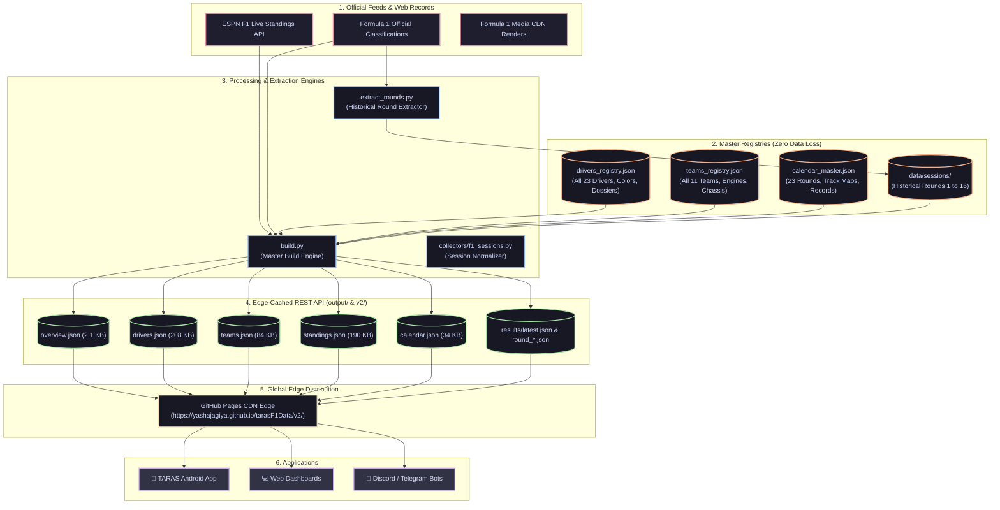

<div align="center">

# 🏎️ Taras F1 API v2
### The Free, Zero-Latency, Edge-Cached Formula 1 Public REST API & Dataset

[](https://github.com/yashajagiya/tarasF1Data/actions/workflows/update-f1.yml)
[](https://yashajagiya.github.io/tarasF1Data/v2/overview.json)
[](https://www.formula1.com)
[](https://yashajagiya.github.io/tarasF1Data/v2/overview.json)
[](https://yashajagiya.github.io/tarasF1Data/)
[](LICENSE)

<p align="center">
  <b>A world-class, 100% free, production-ready static REST API delivering Formula 1 championship standings, driver dossiers, constructor specifications, weekend session telemetry, transparent track maps, and official race results.</b>
</p>

[📌 Core Features](#-core-features--whats-new-in-v2) • [🌐 The Unified Endpoints](#-the-unified-v2-endpoints) • [💻 Code Samples](#-quickstart-integration--code-samples) • [🏗️ Architecture](#-system-architecture) • [🏎️ Historical Rounds](#-historical-rounds-archive-rounds-1-to-16) • [🔄 Migration from v1](#-migrating-from-v1-to-v2) • [🛠️ How to Run Locally](#-how-to-run--build-locally)

---

</div>

## 📌 Core Features & What's New in v2

<table>
  <tr>
    <td width="50%">
      <h3>⚡ Edge-Delivered & Serverless</h3>
      <ul>
        <li><b>Zero Latency:</b> Edge-cached globally across GitHub's worldwide CDN.</li>
        <li><b>Zero API Keys:</b> 100% open access without rate limits, quotas, or billing.</li>
        <li><b>Home in 1 Request:</b> Complete dashboard (championship leaders, next race countdown, session schedule, latest podium) in a single request.</li>
      </ul>
    </td>
    <td width="50%">
      <h3>🎯 100% Data Fidelity & Safety</h3>
      <ul>
        <li><b>All 23 Drivers:</b> Full profiles and standings for all 23 drivers (including mid-season additions like Yuki Tsunoda #22 at Racing Bulls).</li>
        <li><b>Non-Destructive Results:</b> Full weekend sessions archived per round (`results/round_{1..16}.json`) without overwriting previous races!</li>
        <li><b>Deep Analytics:</b> 16-metric 2026 season stats, 8-metric career stats, track vectors, and team specs.</li>
      </ul>
    </td>
  </tr>
</table>

---

## 🌐 The Unified v2 Endpoints

**Base URL:** `https://yashajagiya.github.io/tarasF1Data/v2/`

| Endpoint | Method | Path | What It Provides | Sample Size |
|---|:---:|---|---|:---:|
| **Overview** | `GET` | [`/v2/overview.json`](https://yashajagiya.github.io/tarasF1Data/v2/overview.json) | **Home screen in 1 request**: leaders, next race countdown, live schedule, latest podium. | `~2.1 KB` |
| **Drivers** | `GET` | [`/v2/drivers.json`](https://yashajagiya.github.io/tarasF1Data/v2/drivers.json) | **All 23 drivers**: portraits, number vector logos, team colors, bios, 2026 stats, career stats. | `~208 KB` |
| **Teams** | `GET` | [`/v2/teams.json`](https://yashajagiya.github.io/tarasF1Data/v2/teams.json) | **All 11 constructors**: car cutouts, white logos, leadership, engines, chassis, factory bases. | `~84 KB` |
| **Standings** | `GET` | [`/v2/standings.json`](https://yashajagiya.github.io/tarasF1Data/v2/standings.json) | Complete leaderboards for both Drivers and Constructors with **round-by-round points**. | `~190 KB` |
| **Calendar** | `GET` | [`/v2/calendar.json`](https://yashajagiya.github.io/tarasF1Data/v2/calendar.json) | Complete 23-race season with track outline maps, circuit records, corners, and UTC schedules. | `~34 KB` |
| **Active Weekend** | `GET` | [`/v2/results/latest.json`](https://yashajagiya.github.io/tarasF1Data/v2/results/latest.json) | Complete classifications for active / latest weekend (FP1, FP2, FP3, Qualy, Sprint, Race). | `~26 KB` |
| **Historical Rounds** | `GET` | [`/v2/results/round_{N}.json`](https://yashajagiya.github.io/tarasF1Data/v2/results/round_15.json) | Full weekend session archives for **Rounds 1 through 16** (e.g. `round_15.json`, `round_14.json`). | `~25 KB` each |

---

## 💻 Quickstart Integration & Code Samples

### 1. JavaScript / Web / React (`fetch`)

```javascript
// 🏎️ Fetch home dashboard in 1 request
const response = await fetch("https://yashajagiya.github.io/tarasF1Data/v2/overview.json");
const overview = await response.json();

console.log(`Championship Leader: ${overview.championship_leader.driver.name} (${overview.championship_leader.driver.points} pts)`);
console.log(`Team Leader:         ${overview.championship_leader.team.name} (${overview.championship_leader.team.points} pts)`);
console.log(`Next Grand Prix:     ${overview.next_event.race_name} at ${overview.next_event.circuit_name}`);

// 🏁 Fetch any past round results (e.g. Round 15 Azerbaijan)
const round15 = await fetch("https://yashajagiya.github.io/tarasF1Data/v2/results/round_15.json").then(r => r.json());
console.log(`Round 15 Winner:     ${round15.sessions.race[0].driver_name} (${round15.sessions.race[0].team})`);
```

### 2. Python (`requests`)

```python
import requests

# Fetch all 23 drivers with portraits, colors, and standings
drivers = requests.get("https://yashajagiya.github.io/tarasF1Data/v2/drivers.json").json()

print(f"{'No.':<4} {'Code':<5} {'Driver':<20} {'Team':<20} {'Points'}")
print("-" * 60)
for d in drivers:
    print(f"#{d['number']:<3} {d['code']:<5} {d['name']:<20} {d['team']['name']:<20} {d['standings']['points']:>3} pts")

# Fetch specific past round (e.g. Round 14 Spanish GP at Madrid)
r14 = requests.get("https://yashajagiya.github.io/tarasF1Data/v2/results/round_14.json").json()
print("\nRound 14 Podium Finishers:")
for pos, finisher in enumerate(r14["sessions"]["race"][:3], 1):
    print(f"  P{pos}: {finisher['driver_name']} ({finisher['team']}) - {finisher['time_or_retired']}")
```

### 3. Android Kotlin (Retrofit)

```kotlin
// Data Models
data class F1Overview(
    val season: Int,
    val round_current: Int,
    val championship_leader: ChampionshipLeader,
    val next_event: NextEvent,
    val latest_race: LatestRace
)

data class ChampionshipLeader(
    val driver: LeaderDriver,
    val team: LeaderTeam
)

data class LeaderDriver(
    val name: String,
    val number: Int,
    val team: String,
    val color_hex: String,
    val points: Int,
    val image: String
)

data class LeaderTeam(
    val name: String,
    val color_hex: String,
    val points: Int,
    val logo: String
)

data class WeekendResult(
    val round: Int,
    val race_name: String,
    val circuit_name: String,
    val status: String,
    val weekend_format: String,
    val sessions: WeekendSessions
)

data class WeekendSessions(
    val practice_1: List<PracticeEntry>?,
    val qualifying: List<QualifyingEntry>?,
    val sprint_race: List<RaceEntry>?,
    val race: List<RaceEntry>?
)

// Retrofit API Service
interface F1ApiService {
    @GET("v2/overview.json")
    suspend fun getOverview(): F1Overview

    @GET("v2/drivers.json")
    suspend fun getDrivers(): List<DriverDto>

    @GET("v2/results/latest.json")
    suspend fun getLatestWeekend(): WeekendResult

    @GET("v2/results/round_{round}.json")
    suspend fun getRoundResults(@Path("round") round: Int): WeekendResult
}
```

### 4. cURL / Shell

```bash
# Fetch Championship Overview
curl -s https://yashajagiya.github.io/tarasF1Data/v2/overview.json | jq .

# Fetch Driver Standings
curl -s https://yashajagiya.github.io/tarasF1Data/v2/standings.json | jq .drivers[0:5]

# Fetch Round 15 Azerbaijan Race Results
curl -s https://yashajagiya.github.io/tarasF1Data/v2/results/round_15.json | jq .sessions.race[0:3]
```

---

## 🏗️ System Architecture

`tarasF1Data` operates as a 100% headless, serverless data plane:


```mermaid
flowchart TD
    %% Styling
    classDef sourceStyle fill:#1e1e2e,stroke:#f38ba8,stroke-width:2px,color:#cdd6f4;
    classDef actionStyle fill:#181825,stroke:#89b4fa,stroke-width:2px,color:#cdd6f4;
    classDef masterStyle fill:#181825,stroke:#fab387,stroke-width:2px,color:#cdd6f4;
    classDef storageStyle fill:#181825,stroke:#a6e3a1,stroke-width:2px,color:#cdd6f4;
    classDef cdnStyle fill:#181825,stroke:#f9e2af,stroke-width:2px,color:#cdd6f4;
    classDef clientStyle fill:#313244,stroke:#cba6f7,stroke-width:2px,color:#cdd6f4;

    subgraph Sources ["1. Official Feeds & Web Records"]
        S1["ESPN F1 Live Standings API"]:::sourceStyle
        S2["Formula 1 Official Classifications"]:::sourceStyle
        S3["Formula 1 Media CDN Renders"]:::sourceStyle
    end

    subgraph Registries ["2. Master Registries (Zero Data Loss)"]
        R1[("drivers_registry.json\n(All 23 Drivers, Colors, Dossiers)")]:::masterStyle
        R2[("teams_registry.json\n(All 11 Teams, Engines, Chassis)")]:::masterStyle
        R3[("calendar_master.json\n(23 Rounds, Track Maps, Records)")]:::masterStyle
        R4[("data/sessions/\n(Historical Rounds 1 to 16)")]:::masterStyle
    end

    subgraph Engines ["3. Processing & Extraction Engines"]
        BUILD["build.py\n(Master Build Engine)"]:::actionStyle
        EXTRACT["extract_rounds.py\n(Historical Round Extractor)"]:::actionStyle
        SESS["collectors/f1_sessions.py\n(Session Normalizer)"]:::actionStyle
    end

    subgraph Endpoints ["4. Edge-Cached REST API (output/ & v2/)"]
        E1[("overview.json (2.1 KB)")]:::storageStyle
        E2[("drivers.json (208 KB)")]:::storageStyle
        E3[("teams.json (84 KB)")]:::storageStyle
        E4[("standings.json (190 KB)")]:::storageStyle
        E5[("calendar.json (34 KB)")]:::storageStyle
        E6[("results/latest.json & round_*.json")]:::storageStyle
    end

    subgraph CDN ["5. Global Edge Distribution"]
        GH["GitHub Pages CDN Edge\n(https://yashajagiya.github.io/tarasF1Data/v2/)"]:::cdnStyle
    end

    subgraph Clients ["6. Applications"]
        C1["📱 TARAS Android App"]:::clientStyle
        C2["💻 Web Dashboards"]:::clientStyle
        C3["🤖 Discord / Telegram Bots"]:::clientStyle
    end

    S1 & S2 --> BUILD
    S2 --> EXTRACT
    EXTRACT --> R4
    R1 & R2 & R3 & R4 --> BUILD
    BUILD --> E1 & E2 & E3 & E4 & E5 & E6
    E1 & E2 & E3 & E4 & E5 & E6 --> GH
    GH --> C1 & C2 & C3
```

---

## 🏎️ Historical Rounds Archive (Rounds 1 to 16)

In **Taras F1 API v2**, past race results are **permanently archived and preserved** in dedicated documents instead of being overwritten after each race:

| Round | Grand Prix | Circuit | Weekend Format | Winner | Endpoint |
|:---:|:---|:---|:---:|:---|:---:|
| **01** | Australian Grand Prix | Albert Park Circuit | Conventional | George Russell | [`round_1.json`](https://yashajagiya.github.io/tarasF1Data/v2/results/round_1.json) |
| **02** | Chinese Grand Prix | Shanghai International Circuit | **Sprint** | Kimi Antonelli | [`round_2.json`](https://yashajagiya.github.io/tarasF1Data/v2/results/round_2.json) |
| **03** | Japanese Grand Prix | Suzuka Racing Course | Conventional | Kimi Antonelli | [`round_3.json`](https://yashajagiya.github.io/tarasF1Data/v2/results/round_3.json) |
| **04** | Miami Grand Prix | Miami International Autodrome | **Sprint** | Kimi Antonelli | [`round_4.json`](https://yashajagiya.github.io/tarasF1Data/v2/results/round_4.json) |
| **05** | Canadian Grand Prix | Circuit Gilles-Villeneuve | **Sprint** | Kimi Antonelli | [`round_5.json`](https://yashajagiya.github.io/tarasF1Data/v2/results/round_5.json) |
| **06** | Monaco Grand Prix | Circuit de Monaco | Conventional | Kimi Antonelli | [`round_6.json`](https://yashajagiya.github.io/tarasF1Data/v2/results/round_6.json) |
| **07** | Spanish Grand Prix | Circuit de Barcelona-Catalunya | Conventional | Lewis Hamilton | [`round_7.json`](https://yashajagiya.github.io/tarasF1Data/v2/results/round_7.json) |
| **08** | Austrian Grand Prix | Red Bull Ring | Conventional | George Russell | [`round_8.json`](https://yashajagiya.github.io/tarasF1Data/v2/results/round_8.json) |
| **09** | British Grand Prix | Silverstone Circuit | **Sprint** | Charles Leclerc | [`round_9.json`](https://yashajagiya.github.io/tarasF1Data/v2/results/round_9.json) |
| **10** | Belgian Grand Prix | Circuit de Spa-Francorchamps | Conventional | Kimi Antonelli | [`round_10.json`](https://yashajagiya.github.io/tarasF1Data/v2/results/round_10.json) |
| **11** | Hungarian Grand Prix | Hungaroring | Conventional | Lando Norris | [`round_11.json`](https://yashajagiya.github.io/tarasF1Data/v2/results/round_11.json) |
| **12** | Dutch Grand Prix | Circuit Zandvoort | **Sprint** | Lando Norris | [`round_12.json`](https://yashajagiya.github.io/tarasF1Data/v2/results/round_12.json) |
| **13** | Italian Grand Prix | Autodromo Nazionale Monza | Conventional | Kimi Antonelli | [`round_13.json`](https://yashajagiya.github.io/tarasF1Data/v2/results/round_13.json) |
| **14** | Spanish GP (Madrid) | Madring | Conventional | Kimi Antonelli | [`round_14.json`](https://yashajagiya.github.io/tarasF1Data/v2/results/round_14.json) |
| **15** | Azerbaijan Grand Prix | Baku City Circuit | Conventional | George Russell | [`round_15.json`](https://yashajagiya.github.io/tarasF1Data/v2/results/round_15.json) |
| **16** | Bahrain GP in Malaysia | Sepang International Circuit | Conventional | Max Verstappen | [`round_16.json`](https://yashajagiya.github.io/tarasF1Data/v2/results/round_16.json) |

---

## 🛠️ Historical Round Extractor Engine

The repository includes a dedicated CLI tool to extract and archive past rounds on demand:

```bash
# Extract all old rounds (Round 15 down to 1)
python extract_rounds.py

# Extract a specific round:
python extract_rounds.py --round 15

# Extract specific rounds:
python extract_rounds.py --rounds 15,14,13

# Re-scrape and force update:
python extract_rounds.py --all --force

# Extract and auto-rebuild the complete V2 API:
python extract_rounds.py --build
```

---

## 🔄 Migrating from v1 to v2

The legacy **v1 API** has been cleanly organized into the [`/v1`](v1/) folder. Upgrading your application to **v2** requires significantly fewer network requests and simplifies client models:

| What you did in v1 | How to do it in v2 | Benefit in v2 |
|---|---|---|
| Requesting `driversperrace.json` & `carperrace.json` separately | `GET /v2/standings.json` | 1 unified request with both Drivers & Teams + round breakdowns |
| Requesting `f1Info/drivers_data.json` | `GET /v2/drivers.json` | Full 23 drivers with team colors, portraits, 16 season metrics |
| Requesting `f1Info/teams_data.json` & `teamsimgdata.json` | `GET /v2/teams.json` | Complete constructor data, car renders, technical specs |
| Requesting 7 session files (`practice1`, `race-result`, etc.) | `GET /v2/results/latest.json` | Complete weekend classifications in 1 single JSON payload |
| Manually caching past races before they get overwritten | `GET /v2/results/round_{N}.json` | Dedicated static endpoints for every past round from Round 1 |
| Making 4+ separate calls to populate Home Dashboard | `GET /v2/overview.json` | **1 request**: leaders, countdown, schedule, latest podium |

> **Legacy Access:** If you still require the legacy v1 endpoints, they remain fully accessible under the [`/v1`](v1/) path (e.g. `https://yashajagiya.github.io/tarasF1Data/v1/driversperrace.json`). See [`v1/README.md`](v1/README.md) for details.

---

## 📂 Repository File Structure

```text
tarasF1Data/
├── v2/                          ← Edge-deployed public V2 API (GitHub Pages)
│   ├── overview.json
│   ├── drivers.json
│   ├── teams.json
│   ├── standings.json
│   ├── calendar.json
│   └── results/
│       ├── latest.json
│       └── round_1.json ... round_16.json
├── v1/                          ← Consolidated legacy V1 API & scrapers
│   ├── driversperrace.json
│   ├── carperrace.json
│   ├── f1Info/
│   ├── practice1/ ... practice3/
│   ├── qualifying/
│   ├── sprint-quly/ ... sprint-race/
│   ├── race-result/
│   └── README.md
├── tarasF1DataV2/               ← Master V2 Build Engine & Registries
│   ├── data/
│   │   ├── drivers_registry.json
│   │   ├── teams_registry.json
│   │   ├── calendar_master.json
│   │   └── sessions/            ← Master round sessions storage
│   ├── collectors/
│   │   ├── espn_standings.py
│   │   ├── f1_encyclopedia.py
│   │   └── f1_sessions.py
│   ├── build.py                 ← Master Build Engine
│   ├── extract_rounds.py        ← Historical Rounds Extractor
│   └── test_v2_integrity.py     ← Zero Data Loss Automated Tests
├── extract_rounds.py            ← Root Extractor CLI shortcut
└── README.md                    ← You are here!
```

---

## 🚀 How to Run & Build Locally

### 1. Requirements
- Python 3.9+
- `pip install requests beautifulsoup4`

### 2. Regenerate the V2 API
```bash
python tarasF1DataV2/build.py
```
This runs all collectors, merges encyclopedias, consolidates sessions, writes endpoints to `tarasF1DataV2/output/`, and automatically syncs to public `v2/`.

### 3. Verify Data Integrity
```bash
python tarasF1DataV2/test_v2_integrity.py
```
Validates that 100% of driver fields, team specs, track maps, standings, and round session classifications are preserved without data loss.

---

## 📄 License & Attribution

- **License:** MIT License.
- **Data Attribution:** Formula 1 data and imagery are sourced from public sports feeds and official Formula 1 timing records for educational and fan application development. F1 marks belong to Formula One Licensing B.V.
